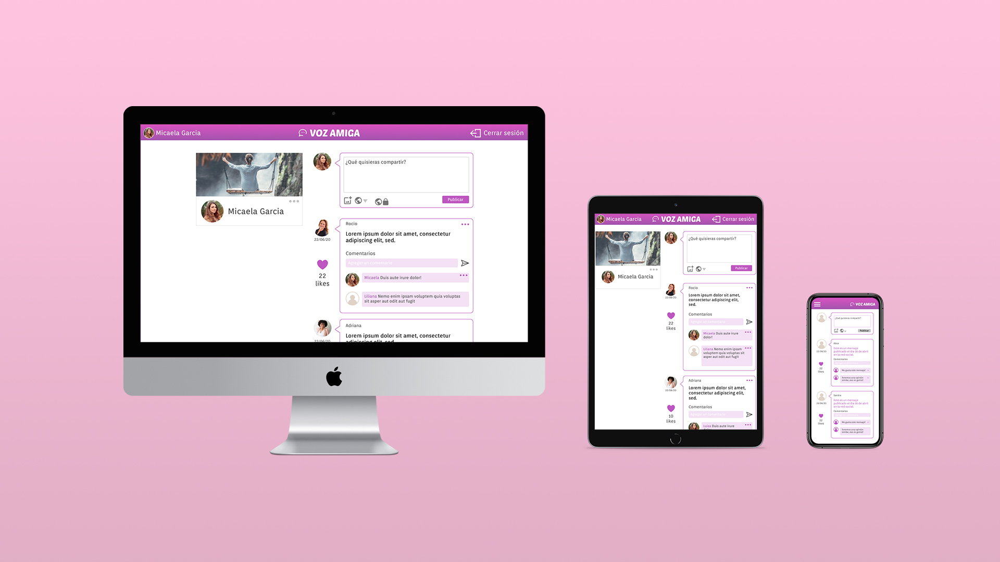

# Red Social "VOZ AMIGA"

## Índice
* [1. Definición del producto](#1-definición)
* [2. Diseño de la Interfaz de Usuario](#2-Diseño-de-la-Interfaz-de-Usuario)
* [3. Testeos de usabilidad](#1-testeos)

***

## 1. Definición del producto

El proyecto VOZ AMIGA, es una red social para mujeres, crea una plataforma que permite brindar un espacio de confianza y de encuentro, en donde mujeres de cualquier parte del mundo puedan expresarse y compartir no solo opiniones y vivencias, sino encontrar el apoyo mutuo y saber que no están solas, descubriendo la verdadera fuerza y poder que tiene toda mujer.

## 2. Diseño de la Interfaz de Usuario

## 3. Test de usabilidad

Resultados de los tests de usabilidad:

Luego de los tests con usuarios realizamos mejoras según el feedback recibido 

Inicio de sesión y registro
- Dar jerarquía a los botones mediante el color: el botón con mayor contraste (fondo blanco) llama más a atención por lo tanto lo cambiamos al de iniciar sesión, el cual tiene mayor importancia
- La opción de ingreso con Google inicialmente solo se veía en la vista de iniciar sesión y no de registro, eso generaba confusión en el caso que la personas quiera ingresar a la página por primera vez, por lo tanto también lo agregamos a la vista de registro

Home y perfil
- Agregar la hora que se realizó los posteos
- Agregar un botón de cancelar si no se quiere guardar los cambios en el perfil
- Cuando se carga una foto para hacer un post falta una opción para eliminarla en caso que ya no la quiero publicar

***

# Creando una Red Social

## Consideraciones generales del proyecto

* Este proyecto debe ser desarrollado en equipos de trabajo de 3 integrantes.

* La duración propuesta del proyecto es **3 sprints**, con una duración de una semana cada uno.

* Te daremos las **historias de usuario** con el fin de presentarte los requerimientos y funcionalidades que desea el usuario final.

* La **planificación es vital**, para ello te recomendamos utilizar el flujo de trabajo colaborativo que nos ofrecen los projects de GitHub, para que puedas **escribir tus definiciones de terminado** y **criterios de aceptación** por cada historia de usuario con el objetivo que determinen, en equipo, **qué hacer** en el sprint y **cómo se realizará**.

* Para que todas las miembros de tu equipo puedan lograr los objetivos de aprendizaje, deberán determinar cuál será la estrategia de desarrollo que utilizarán: división por sub-historias, pair programming, code reviews, etc.

## Restricciones Técnicas

* Debes utilizar `flexbox` para posicionar tus elementos. No está permitido el uso de frameworks de CCS (bootstrap), ni de componentes flotantes.

* Ya te damos un diseño (layout) de la vista mobile y desktop, queremos que lo repliques a nivel *pixel perfect*, el contenido, paleta de colores y fuentes, depende de la temática que van a elegir como equipo. La implementación de ese layout deberá formar parte de la *definición de terminado* de tus historias de usuario.

* Los test son **fundamentales** y deberán formar parte de tu definición de terminado, te recomendamos que comiences a implementarlos desde el comienzo.

## Historias de Usuario

* Como usuario nuevo debo poder crear una cuenta con email y password válidos para poder iniciar sesion e ingresar a la red social.

* Como usuario nuevo debo poder tener la opción de iniciar sesión con mi cuenta de Google o Facebook para ingresar a la red social sin necesidad de crear una cuenta de email válido.

* Como usuario loggeado debo poder crear, guardar, modificar en el mismo lugar (in place) y eliminar una publicación (post) privada o pública, que puede ser una frase o una imagen.

* Como usuario loggeado debo poder ver todos los posts públicos y privados que he creado hasta ese momento, desde el más reciente hasta el más antiguo, así como la opción de poder cambiar la configuración de privacidad de mis post.

* Yo como usuario loggeado, puedo dar like y llevar un conteo de likes en mi publicación así como poder escribir, guardar, editar o eliminar un comentario en mi publicación.

* Al final debo poder ingresar a la red social y poder visualizar los datos de mi perfil creado o editarlos.

## Objetivos de aprendizaje

Antes de empezar el proyecto, recuerda agregar tus objetivos de aprendizaje pendientes de tu proyecto
anterior en la siguiente sección.

### Objetivos de aprendizajes pendientes

### HTML y CSS

* [x] [HTML semántico](https://developer.mozilla.org/en-US/docs/Glossary/Semantics#Semantics_in_HTML)
* [x] [CSS `flexbox`](https://css-tricks.com/snippets/css/a-guide-to-flexbox/)
* [x] Construir tu aplicación respetando el diseño realizado (maquetación).

### DOM y Web APIs

* [x] [Manipulación dinámica del DOM](https://developer.mozilla.org/es/docs/Referencia_DOM_de_Gecko/Introducci%C3%B3n)
* [ ] [History API](https://developer.mozilla.org/es/docs/DOM/Manipulando_el_historial_del_navegador)
* [x] [`localStorage`]

### Javascript

* [x] [Uso de callbacks](https://developer.mozilla.org/es/docs/Glossary/Callback_function)
* [x] [Consumo de Promesas](https://scotch.io/tutorials/javascript-promises-for-dummies#toc-consuming-promises)
* [x] Uso ES modules
([`import`](https://developer.mozilla.org/en-US/docs/Web/JavaScript/Reference/Statements/import)
| [`export`](https://developer.mozilla.org/en-US/docs/Web/JavaScript/Reference/Statements/export))

### Firebase

* [x] [Firestore](https://firebase.google.com/docs/firestore)
* [x] [Firebase Auth](https://firebase.google.com/docs/auth/web/start)
* [x] [Firebase security rules](https://firebase.google.com/docs/rules)
* [x] [Uso de onSnapshot](https://firebase.google.com/docs/firestore/query-data/listen)
| [onAuthStateChanged](https://firebase.google.com/docs/auth/web/start#set_an_authentication_state_observer_and_get_user_data)

### Testing

* [x] [Testeo de tus funciones](https://jestjs.io/docs/es-ES/getting-started)
* [ ] [Testeo asíncrono](https://jestjs.io/docs/es-ES/asynchronous)
* [x] [Mocking](https://jestjs.io/docs/es-ES/manual-mocks)

### Colaboración en Github

* [x] Branches
* [x] Pull Requests
* [ ] Tags

### Organización en Github

* [x] Projects
* [x] Issues
* [x] Labels
* [x] Milestones

### Buenas prácticas de desarrollo

* [ ] Modularización
* [x] Nomenclatura / Semántica
* [x] Linting

***
